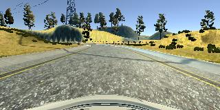
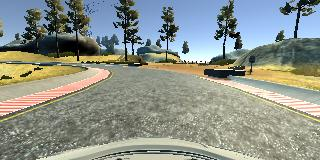
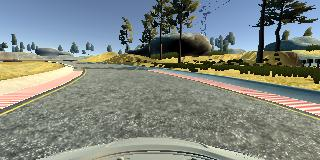
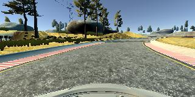

# **Behavioral Cloning** 

**Behavioral Cloning Project**

The goals / steps of this project are the following:
* Use the simulator to collect data of good driving behavior
* Build, a convolution neural network in Keras that predicts steering angles from images
* Train and validate the model with a training and validation set
* Test that the model successfully drives around track one without leaving the road
* Summarize the results with a written report


# Rubric Points
Here I will consider the [rubric points](https://review.udacity.com/#!/rubrics/432/view) individually and describe how I addressed each point in my implementation.  

---
## Files Submitted & Code Quality

### 1. Submission includes all required files and can be used to run the simulator in autonomous mode

My project includes the following files:
* model.py containing the script to create and train the model
* drive.py for driving the car in autonomous mode
* model.h5 containing a trained convolution neural network 
* writeup_report.md summarizing the results
* video.mp4 a video recording of the vehicle driving autonomously around the track for one full lap

### 2. Submission includes functional code
Using the Udacity provided simulator and my drive.py file, the car can be driven autonomously around the track by executing 
```sh
python drive.py model.h5
```

### 3. Submission code is usable and readable

The model.py file contains the code for training and saving the convolution neural network.  The file shows the pipeline I used for training and validating the model, and it contains comments to explain how the code works.

## Model Architecture and Training Strategy

### 1. An appropriate model architecture has been employed

My initial model is based on the LeNet CNN architecture with a final fully connected output node providing the steering angle.
* The first convolutional layer uses a 5x5 kernel with valid padding and a ReLU activation function.  The output depth is 6.  https://keras.io/layers/convolutional/#conv2d
* Then max pooling is applied with the Keras default 2x2 filter size and a stride of 2. https://keras.io/layers/pooling/#maxpooling2d
* The 2nd convolutional layer also uses a 5x5 kernel with valid padding and a ReLU activation function.  The output depth is 6.
* Again max pooling is applied with the Keras default 2x2 filter size and a stride of 2.
* The output is then flattened to 1-D.  https://keras.io/layers/core/#flatten
* Then a fully connected layer (AKA dense layer) with 120 nodes.  https://keras.io/layers/core/#dense
* Then a second fully connected with 84 nodes.
* Then a final fully connected layer with one output node.

### 2. Attempts to reduce overfitting in the model

The data was split with 80% used for training and 20% used for validation.  It was found that while the training and validation accuracy and loss graphs might look good with regards to over or underfitting the actual performance in the simulator would not be good enough to keep the vehicle on the track.  The most effective way found to allow the model to perform well on the track was to add additional data by recording manual driving sessions.

### 3. Model parameter tuning

The model used an adam optimizer, so the learning rate was not tuned manually. 

### 4. Appropriate training data

The training data provided with the project contained many data points where the steering angle was 0, ie the car was driving straight.  Filtering out these data points allowed the model to learn to deal with turns better.  When adding additional data by manually driving the car it was found to be much more effective to use smooth inputs by controlling the car with a mouse.  Additionally, turns were negotiated at low speeds to ensure the car stayed in the middle of the road and that there were many data points recorded mid-turn.  


## Model Architecture and Training Strategy

### 1. Solution Design Approach

The overall strategy for deriving a model architecture was to use an existing and relatively simple model.  The simulated track provides a clean image with the road well defined and only steering angle needs to be output.  I wanted to see how well a simple model could perfrom with quality training data before exploring more complex models.

My first step was to use a LeNet architecture convolution neural network model.  While this model is performing regression to output continuous steering angles I thought the LeNet architecutre previously used for image classification could perform well as the output steering angle does not require a huge variance to get the car around the track.  This model is essentially classifying road images as steering angles and LeNet performs well at basic image classification. 

In order to gauge how well the model was working, I split my image and steering angle data into a training and validation set. I found that initially my model had a low mean squared error on the training set but a high mean squared error on the validation set.  This implied that the model was overfitting.  Examining the data set, I found the large number for 0 steering angle data points seemed to be introducing lots of bias and preventing the model from generalizing to turns.

To combat this issue I filtered out the data points where the steering angle was zero.  I then found the model was underfitting and so I augmented the training data by horizontally flipping the images and inverting the associated steering angle. 

The final step was to run the simulator to see how well the car was driving around track one. There were a few spots where one of the edges of the road was not clearly marked with a line or curb and the vehicle tracked off into the dirt.  To improve the driving behavior in these cases, I recorded more data points of the car sucessfully driving through these portions.

At the end of the process, the vehicle is able to drive autonomously around the track without leaving the road.

### 2. Final Model Architecture

The final model architecture is very similar to the initial LeNet model.  The difference is in how the data is processed.  My final model consists of:
*  An input layer that has the input images cropped to remove extraneous portions of the images and the pixel values normalized to be approximately zero mean and unit variance.  https://keras.io/layers/convolutional/#cropping2d
* The first convolutional layer uses a 5x5 kernel with valid padding and a ReLU activation function.  The output depth is 6.  https://keras.io/layers/convolutional/#conv2d
* Then max pooling is applied with the Keras default 2x2 filter size and a stride of 2. https://keras.io/layers/pooling/#maxpooling2d
* The 2nd convolutional layer also uses a 5x5 kernel with valid padding and a ReLU activation function.  The output depth is 6.
* Again max pooling is applied with the Keras default 2x2 filter size and a stride of 2.
* The output is then flattened to 1-D.  https://keras.io/layers/core/#flatten
* Then a fully connected layer (AKA dense layer) with 120 nodes.  https://keras.io/layers/core/#dense
* Then a second fully connected with 84 nodes.
* Then a final fully connected layer with one output node.


### 3. Creation of the Training Set & Training Process

To capture good driving behavior, I first recorded one lap on track manually driving in the center of the lane. Here is an example image of center lane driving:



I then recorded then recorded another pass through turns where the curb was not clearly defined such as below.



This was enough to get the car to navigate around the track without issue.  Then while the car was successfully driving around the track in autonomous mode I used the manualy override feature to place the car off the center of the lane to see if it could recover when a returned it to autonomous mode and it did. 

To augment the data set, I generated new data points by flipping images and their corresponding angles for all the existing data points.  This also ensured there was an even distribution of left and right turn data points.  Here is an example of an image that has been flipped:




The final data set included the supplied training data, data points from recorded manual driving sessions, and flipped the images with any data points with a steering angle of 0 filtered out.  This yielded 6,482 data points.  I then preprocessed this data by normalizing the pixel values and cropping the top and bottom of the images.

I finally randomly shuffled the data set and put 20% of the data into a validation set. 

I used this training data for training the model.  The validation set helped determine if the model was over or under fitting.  The ideal number of epochs was 6 as evidenced by an increase in validation loss when using more epochs.  I used an adam optimizer so that manually training the learning rate wasn't necessary.
